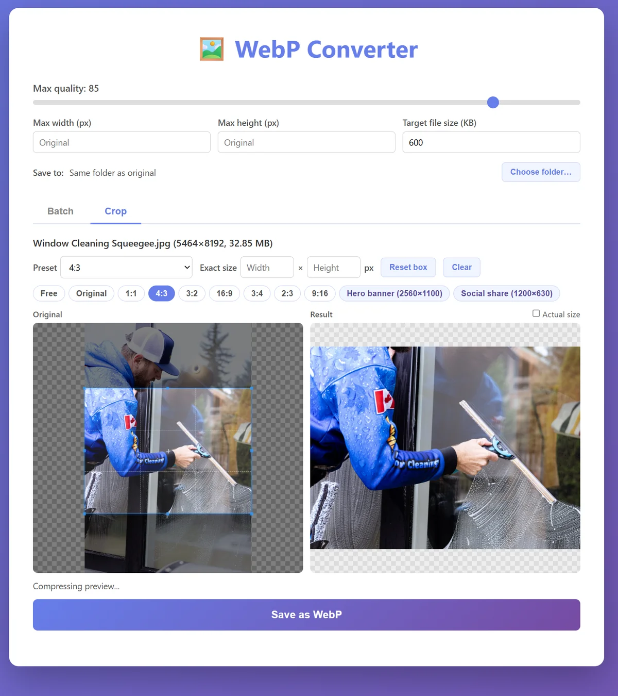

# WebP Converter

A Windows desktop app for turning JPG, PNG, HEIC, and WebP images into small, web-ready WebP files. Resize, hit a target file size, or crop to an exact size, with a live preview of the result before you save.



## Download

**[Download the latest installer](https://github.com/SupermanServicesCA/JPG-PNG-HEIC-to-WebP-Converter/releases/latest)** (Windows 10/11, 64-bit), then run `WebP-Converter-Setup-x.x.x.exe`.

The installer isn't code-signed, so Windows may show a SmartScreen warning. Click **More info → Run anyway**. New versions install over old ones and keep your settings.

## Features

- **Batch convert** JPG, PNG, HEIC, and WebP to WebP by drag and drop
- **Resize** to a max width and/or height (images are only ever shrunk, never enlarged)
- **Target file size:** each image gets the highest quality that fits; files that can't reach it are flagged
- **Live preview** of each file's output size and dimensions before converting
- **Crop tab** with ratio and exact-size presets (e.g. 16:9, 2560×1100), editable to match your site
- **Save to** the original's folder or a folder you choose
- Phone photos come out upright, and everything runs offline

## How to use

The **Quality**, **Max width/height**, **Target file size**, and **Save to** settings at the top apply to both tabs.

### Batch

1. Drag images onto the drop zone (or click it to browse).
2. Check the estimated size shown next to each file, and adjust the settings if needed.
3. Click **Convert to WebP**.

Files are saved as `name.webp`. Converted WebP files are saved as `name-optimized.webp` so the original is never overwritten.

### Crop

1. Drop one image onto the Crop tab.
2. Pick a preset from the dropdown or the buttons (**Free**, **Original**, a ratio, or an exact size), or type an exact width × height.
3. Drag the crop box to choose what to keep. The **Result** pane shows the compressed output and its file size; tick **Actual size** to check detail at 100%.
4. Click **Save as WebP**. The file is saved as `name-2560x1100.webp`; saving the same size again adds `-2`, `-3`, and so on.

With an exact size, the output is exactly that size. If the selected area is smaller, the app warns you and saves the largest size with the same shape instead of enlarging the image.

To change the presets, choose **Edit presets…** at the bottom of the dropdown. A **Ratio** preset only locks the crop box's shape; an **Exact size** preset also sets the output size.

## Build from source

Requires [Node.js](https://nodejs.org/) 20 or later.

```bash
npm install
npm start           # run the app in development mode
npm run build:win   # build the Windows installer into dist/
```

See [BUILD_WINDOWS.md](BUILD_WINDOWS.md) for Windows build setup and troubleshooting.

## Built with

- [Electron](https://www.electronjs.org/): desktop app framework
- [sharp](https://sharp.pixelplumbing.com/) (libvips + libwebp): image decoding, resizing, and WebP encoding
- [Cropper.js](https://github.com/fengyuanchen/cropperjs): crop box
- [heic-convert](https://github.com/catdad-experiments/heic-convert): HEIC/HEIF decoding

## License

MIT
